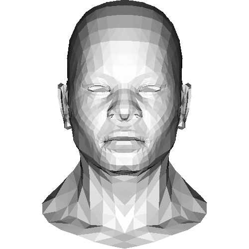
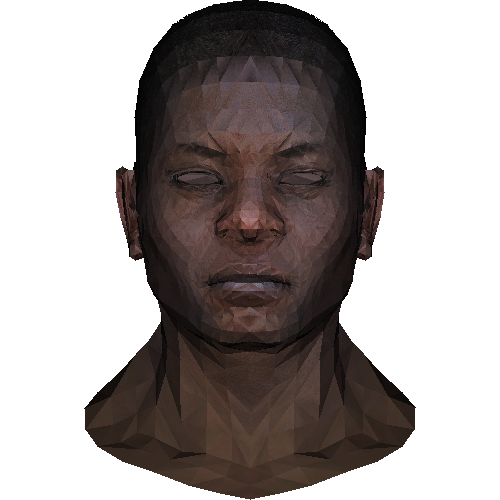

# Depth Buffer
## Z buffer
我们需要判断 obj 三角形面片中每个像素的深度值，已决定是否绘制该像素点。
```C++
// 计算 P 在三角形中的重心坐标
Vec3f barycentric(Vec3i *pts, Vec3i P) {
    // 重心坐标的权重与之垂直
    Vec3f u = Vec3f(pts[2].x - pts[0].x, pts[1].x - pts[0].x, pts[0].x - P.x) ^
              Vec3f(pts[2].y - pts[0].y, pts[1].y - pts[0].y, pts[0].y - P.y);
    // z = 0 等价于三角形两边平行，退化情况
    if (std::abs(u.z) < 1) return Vec3f(-1, 1, 1);
    // 权重归一化
    return Vec3f(1 - (u.x + u.y) / u.z, u.x / u.z, u.y / u.z);
}

// 输入三角形的三个顶点
void triangle(Vec3i *pts, int *zBuffer, TGAImage &image, TGAColor color) {
    // 寻找三角形的包围盒
    Vec2i bboxmin(image.get_width() - 1, image.get_height() - 1);
    Vec2i bboxmax(0, 0);
    Vec2i clamp(image.get_width() - 1, image.get_height() - 1);
    for (int i = 0; i < 3; i++) {
        // 寻找三角形三个顶点关于x, y 的最大最小值
        bboxmax.x = std::min(clamp.x, std::max(bboxmax.x, pts[i].x));
        bboxmax.y = std::min(clamp.y, std::max(bboxmax.y, pts[i].y));
        bboxmin.x = std::max(0, std::min(bboxmin.x, pts[i].x));
        bboxmin.y = std::max(0, std::min(bboxmin.y, pts[i].y));
    }
    // 通过一个向量的重心坐标判断是否在三角形内
    Vec3i P;
    for (P.x = bboxmin.x; P.x <= bboxmax.x; P.x++)
        for (P.y = bboxmin.y; P.y <= bboxmax.y; P.y++) {
            // 计算该点的三角形重心坐标
            Vec3f bc_screen = barycentric(pts, P);
            // 判断是否在三角形中
            if (bc_screen.x < 0 || bc_screen.y < 0 || bc_screen.z < 0) continue;
            // 用重心坐标计算像素的深度 z 值
            P.z = bc_screen.x * pts[0].z + bc_screen.y * pts[1].z + bc_screen.z * pts[2].z;
            // 判断是否需要写入深度缓冲
            if (zBuffer[int(P.x + P.y * width)] < P.z) {
                zBuffer[int(P.x + P.y * width)] = P.z;
                image.set(P.x, P.y, color);
            }
        }
}


int main(int argc, char **argv) {
    // 创建环境
    TGAImage image(width, height, TGAImage::RGB);
    // 实例化模型
    Model model("../obj/african_head.obj");
    // 光照环境
    // 假设光垂直于屏幕
    Vec3f light_dir(0, 0, -1);
    light_dir.normalize();
    // 初始化深度缓冲区
    int *zbuffer = new int[width * height];
    for (int i = 0; i < width * height; i++)
        zbuffer[i] = std::numeric_limits<int>::min();
    // 遍历模型的三角形面片
    for (int i = 0; i < model.nfaces(); i++) {
        std::vector<int> face = model.face(i);
        // 屏幕坐标系
        Vec3i screen_coords[3];
        // 模型世界坐标系
        Vec3f world_coords[3];
        for (int j = 0; j < 3; j++) {
            Vec3f v = model.vert(face[j]);
            // 做 viewport transform
            screen_coords[j] = Vec3i((v.x + 1.) * width / 2.,
                                     (v.y + 1.) * height / 2., v.z);
            world_coords[j] = v;
        }
        // 计算三角形法线方向
        Vec3f n = (world_coords[2] - world_coords[0]) ^ (world_coords[1] - world_coords[0]);
        // 法向量单位化
        n.normalize();

        // 定义光照强度 法向量与光线的内积
        float intensity = n * light_dir;
        // 要求光照强度为正，否则表示在光照背面
        if (intensity > 0) {
            triangle(screen_coords, zbuffer, image,
                     TGAColor(intensity * 255, intensity * 255, intensity * 255, 255));
        }
    }
    // 垂直翻转，把原点移到左下角
    image.flip_vertically();
    image.write_tga_file("output.tga");
    return 0;
}
```


## 贴上纹理
我们需要读取 obj 文件中的纹理坐标，因此修改 `model.h` 如下：
```C++
#ifndef __MODEL_H__
#define __MODEL_H__

#include <vector>
#include "geometry.h"
#include "tgaimage.h"

class Model {
private:
    // 从上到下顶点
    std::vector<Vec3f> verts_;
    // vertex, uv, normal
    std::vector<std::vector<Vec3i> > faces_;
    // 从上到下顶点法向量
    std::vector<Vec3f> norms_;
    // 从上到下纹理映射坐标
    std::vector<Vec2f> uv_;
    TGAImage diffusemap_;

    void load_texture(std::string filename, const char *suffix, TGAImage &img);

public:
    Model(const char *filename);

    ~Model();

    int nverts();

    int nfaces();

    Vec3f vert(int i);

    // 获取纹理映射坐标
    Vec2i uv(int iface, int nvert);

    // 获取对应纹理坐标颜色
    TGAColor diffuse(Vec2i uv);

    std::vector<int> face(int idx);
};

#endif //__MODEL_H__
```

修改 `model.cpp` 文件如下：
```C++
#include <iostream>
#include <string>
#include <fstream>
#include <sstream>
#include <vector>
#include "model.h"

Model::Model(const char *filename) : verts_(), faces_(), norms_(), uv_() {
    std::ifstream in;
    in.open(filename, std::ifstream::in);
    if (in.fail()) return;
    std::string line;
    while (!in.eof()) {
        std::getline(in, line);
        std::istringstream iss(line.c_str());
        char trash;
        if (!line.compare(0, 2, "v ")) {
            iss >> trash;
            Vec3f v;
            for (int i = 0; i < 3; i++) iss >> v.raw[i];
            verts_.push_back(v);
        } else if (!line.compare(0, 3, "vn ")) {
            iss >> trash >> trash;
            Vec3f n;
            for (int i = 0; i < 3; i++) iss >> n.raw[i];
            norms_.push_back(n);
        } else if (!line.compare(0, 3, "vt ")) {
            iss >> trash >> trash;
            Vec2f uv;
            for (int i = 0; i < 2; i++) iss >> uv.raw[i];
            uv_.push_back(uv);
        } else if (!line.compare(0, 2, "f ")) {
            std::vector<Vec3i> f;
            Vec3i tmp;
            iss >> trash;
            while (iss >> tmp.raw[0] >> trash >> tmp.raw[1] >> trash >> tmp.raw[2]) {
                for (int i = 0; i < 3; i++) tmp.raw[i]--; // in wavefront obj all indices start at 1, not zero
                f.push_back(tmp);
            }
            faces_.push_back(f);
        }
    }
    std::cerr << "# v# " << verts_.size() << " f# " << faces_.size() << " vt# " << uv_.size() << " vn# "
              << norms_.size() << std::endl;
    load_texture(filename, "_diffuse.tga", diffusemap_);
}

Model::~Model() {
}

int Model::nverts() {
    return (int) verts_.size();
}

int Model::nfaces() {
    return (int) faces_.size();
}


std::vector<int> Model::face(int idx) {
    std::vector<int> face;
    for (int i = 0; i < (int) faces_[idx].size(); i++)
        face.push_back(faces_[idx][i].raw[0]);
    return face;
}

Vec3f Model::vert(int i) {
    return verts_[i];
}

void Model::load_texture(std::string filename, const char *suffix, TGAImage &img) {
    std::string texfile(filename);
    size_t dot = texfile.find_last_of(".");
    if (dot != std::string::npos) {
        texfile = texfile.substr(0, dot) + std::string(suffix);
        std::cerr << "texture file " << texfile << " loading " << (img.read_tga_file(texfile.c_str()) ? "ok" : "failed")
                  << std::endl;
        img.flip_vertically();
    }
}

TGAColor Model::diffuse(Vec2i uv) {
    return diffusemap_.get(uv.x, uv.y);
}

Vec2i Model::uv(int iface, int nvert) {
    int idx = faces_[iface][nvert].raw[1];
    return Vec2i(uv_[idx].x * diffusemap_.get_width(), uv_[idx].y * diffusemap_.get_height());
}
```

最后使用重心坐标，对每个像素点进行插值，获得对应纹理颜色
```C++
//
// Created by Kingsley Cheng on 2023/3/23.
//
#include <iostream>
#include "tgaimage.h"
#include "model.h"

// 创建两种颜色
const TGAColor white = TGAColor(255, 255, 255, 255);
const TGAColor red = TGAColor(255, 0, 0, 255);

// 环境高宽
const int width = 500;
const int height = 500;


void line(int x0, int y0, int x1, int y1, TGAImage &image, TGAColor color) {
    bool steep = false; // 标记当前斜率的绝对值是否大于 1
    if (std::abs(x1 - x0) < std::abs(y1 - y0)) {
        // 若斜率大于 1， 我们将做关于 y=x 对称
        steep = true;
        std::swap(x0, y0);
        std::swap(x1, y1);
    }
    // 判断是 x0 大还是 x1 大
    if (x0 > x1) {
        std::swap(x0, x1);
        std::swap(y0, y1);
    }
    int dx = x1 - x0;
    int dy = y1 - y0;
    int derror2 = 2 * std::abs(dy);
    int error2 = 0;
    int y = y0;
    for (int x = x0; x <= x1; x++) {
        if (steep)
            image.set(y, x, color);
        else
            image.set(x, y, color);
        // Bresenham’s Linear Algorithm
        error2 += derror2;
        if (error2 > dx) {
            error2 -= 2 * dx;
            y += (y1 > y0 ? 1 : -1);
        }
    }
}

// 计算 P 在三角形中的重心坐标
Vec3f barycentric(Vec3i *pts, Vec3i P) {
    // 重心坐标的权重与之垂直
    Vec3f u = Vec3f(pts[2].x - pts[0].x, pts[1].x - pts[0].x, pts[0].x - P.x) ^
              Vec3f(pts[2].y - pts[0].y, pts[1].y - pts[0].y, pts[0].y - P.y);
    // z = 0 等价于三角形两边平行，退化情况
    if (std::abs(u.z) < 1) return Vec3f(-1, 1, 1);
    // 权重归一化
    return Vec3f(1 - (u.x + u.y) / u.z, u.x / u.z, u.y / u.z);
}

// 输入三角形的三个顶点
void triangle(Vec3i *pts, Vec2i *texture_pts, Model &model, int *zBuffer, TGAImage &image, float intensity) {
    // 寻找三角形的包围盒
    Vec2i bboxmin(image.get_width() - 1, image.get_height() - 1);
    Vec2i bboxmax(0, 0);
    Vec2i clamp(image.get_width() - 1, image.get_height() - 1);
    for (int i = 0; i < 3; i++) {
        // 寻找三角形三个顶点关于x, y 的最大最小值
        bboxmax.x = std::min(clamp.x, std::max(bboxmax.x, pts[i].x));
        bboxmax.y = std::min(clamp.y, std::max(bboxmax.y, pts[i].y));
        bboxmin.x = std::max(0, std::min(bboxmin.x, pts[i].x));
        bboxmin.y = std::max(0, std::min(bboxmin.y, pts[i].y));
    }
    Vec3i P;
    Vec2i uv;
    TGAColor color;
    // 通过一个向量的重心坐标判断是否在三角形内
    for (P.x = bboxmin.x; P.x <= bboxmax.x; P.x++)
        for (P.y = bboxmin.y; P.y <= bboxmax.y; P.y++) {
            // 计算该点的三角形重心坐标
            Vec3f bc_screen = barycentric(pts, P);
            // 判断是否在三角形中
            if (bc_screen.x < 0 || bc_screen.y < 0 || bc_screen.z < 0) continue;
            // 用重心坐标计算像素的深度 z 值
            P.z = bc_screen.x * pts[0].z + bc_screen.y * pts[1].z + bc_screen.z * pts[2].z;
            // 判断是否需要写入深度缓冲
            if (zBuffer[int(P.x + P.y * width)] < P.z) {
                zBuffer[int(P.x + P.y * width)] = P.z;
                // 用重心坐标获取纹理坐标
                uv.u = bc_screen.x * texture_pts[0].x + bc_screen.y *
                                                        texture_pts[1].x + bc_screen.z * texture_pts[2].x;
                uv.v = bc_screen.x * texture_pts[0].y + bc_screen.y *
                                                        texture_pts[1].y + bc_screen.z * texture_pts[2].y;
                // 获取纹理颜色
                color = model.diffuse(uv);
                for (int j = 0; j < 3; j++)
                    color.raw[j] *= intensity;
                image.set(P.x, P.y, color);
            }
        }
}


int main(int argc, char **argv) {
    // 创建环境
    TGAImage image(width, height, TGAImage::RGB);
    // 实例化模型
    Model model("../obj/african_head.obj");
    // 光照环境
    // 假设光垂直于屏幕
    Vec3f light_dir(0, 0, -1);
    light_dir.normalize();
    // 初始化深度缓冲区
    int *zbuffer = new int[width * height];
    for (int i = 0; i < width * height; i++)
        zbuffer[i] = std::numeric_limits<int>::min();

    // 遍历模型的三角形面片
    for (int i = 0; i < model.nfaces(); i++) {
        std::vector<int> face = model.face(i);
        // 屏幕坐标系
        Vec3i screen_coords[3];
        // 模型世界坐标系
        Vec3f world_coords[3];
        // 纹理坐标系
        Vec2i texture_color[3];
        for (int j = 0; j < 3; j++) {
            Vec3f v = model.vert(face[j]);
            // 做 viewport transform
            screen_coords[j] = Vec3i((v.x + 1.) * width / 2.,
                                     (v.y + 1.) * height / 2.,
                                     v.z);
            // 纹理位置
            texture_color[j] = model.uv(i, j);
            world_coords[j] = v;
        }
        // 计算三角形法线方向
        Vec3f n = (world_coords[2] - world_coords[0]) ^ (world_coords[1] - world_coords[0]);
        // 法向量单位化
        n.normalize();
        // 定义光照强度 法向量与光线的内积
        float intensity = n * light_dir;
        // 要求光照强度为正，否则表示在光照背面
        if (intensity > 0) {
            triangle(screen_coords, texture_color, model, zbuffer, image, intensity);
        }
    }
    // 垂直翻转，把原点移到左下角
    image.flip_vertically();
    image.write_tga_file("output.tga");
    return 0;
}
```
