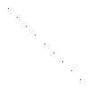
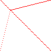
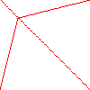
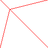
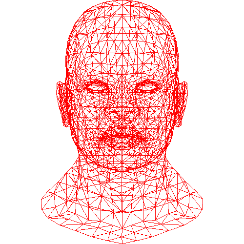

# Bresenham's Line Drawing Algorithm
## Attempt 1 线性插值
```C++

// 给定直线两点(x0, y0), (x1, y1)
void line(int x0, int y0, int x1, int y1, TGAImage &image, TGAColor color) {
    for (float t = 0; t <= 1.; t += 0.1) {
        // 在（x0, y0）和（x1，y1）之间做线性差值
        int x = x0 + (x1 - x0) * t;
        int y = y0 + (y1 - y0) * t;
        image.set(x, y, color);
    }
}

// main() 函数中
line(0, 100, 100, 0, image, red);
```


循环次数太多，效率太低。

## Attempt 2 根据 x 坐标循环
```C++
// 给定直线两点(x0, y0), (x1, y1)
void line(int x0, int y0, int x1, int y1, TGAImage &image, TGAColor color) {
    // 根据 x 坐标递增计算 y 坐标
    for(int x=x0; x<=x1; x++){
        // x 方向的增量
        float t = (x-x0) / float(x1-x0);
        int y = (1.-t) * y0 + t * y1;
        image.set(x,y,color);
    }
}

// main() 函数中
line(0, 100, 100, 0, image, red);
line(20, 80, 100, 100, image, red);
line(0, 0, 20, 80, image, red);
```


斜率超过 1 时会出现不连续，而且必须要求 $x_0\leq x_1$。

## Attempt 3 直线绘制
```C++
// 给定直线两点(x0, y0), (x1, y1)
void line(int x0, int y0, int x1, int y1, TGAImage &image, TGAColor color) {
    // 用于判断直线斜率是否大于 1，后期画线需要翻转
    bool steep = false;
    // 如果斜率大于 1 翻转到 y=x 下方绘画
    if (std::abs(x1 - x0) < std::abs(y1 - y0)) {
        std::swap(x0, y0);
        std::swap(x1, y1);
        steep = true;
    }
    // 直线绘制从线 x0 开始还是 x1 开始
    if (x0 > x1) {
        std::swap(x0, x1);
        std::swap(y0, y1);
    }

    for (int x = x0; x <= x1; x++) {
        // x 方向的增量
        float t = (x - x0) / float(x1 - x0);
        int y = (1. - t) * y0 + t * y1;
        if (steep)
            // 需要翻转
            image.set(y, x, color);
        else
            image.set(x, y, color);
    }
}

// main() 函数中
line(0, 100, 100, 0, image, red);
line(20, 80, 100, 100, image, red);
line(0, 0, 20, 80, image, red);
```


## Attempt 4 降低不必要的重复计算
```C++
// 给定直线两点(x0, y0), (x1, y1)
void line(int x0, int y0, int x1, int y1, TGAImage &image, TGAColor color) {
    // 用于判断直线斜率是否大于 1，后期画线需要翻转
    bool steep = false;
    // 如果斜率大于 1 翻转到 y=x 下方绘画
    if (std::abs(x1 - x0) < std::abs(y1 - y0)) {
        std::swap(x0, y0);
        std::swap(x1, y1);
        steep = true;
    }
    // 直线绘制从线 x0 开始还是 x1 开始
    if (x0 > x1) {
        std::swap(x0, x1);
        std::swap(y0, y1);
    }

    int dx = x1 - x0;
    int dy = y1 - y0;
    float derror = std::abs(dy / float(dx));
    float error = 0;
    int y = y0;

    for (int x = x0; x <= x1; x++) {
        if (steep)
            // 需要翻转
            image.set(y, x, color);
        else
            image.set(x, y, color);
        error += derror;
        if (error > .5) {
            error -= 1.;
            y += (y1 > y0 ? 1 : -1);
        }
    }
}

// main() 函数中
line(0, 100, 100, 0, image, red);
line(20, 80, 100, 100, image, red);
line(0, 0, 20, 80, image, red);
```



## Attempt 5 去除浮点数计算
```C++
// 给定直线两点(x0, y0), (x1, y1)
void line(int x0, int y0, int x1, int y1, TGAImage &image, TGAColor color) {
    // 用于判断直线斜率是否大于 1，后期画线需要翻转
    bool steep = false;
    // 如果斜率大于 1 翻转到 y=x 下方绘画
    if (std::abs(x1 - x0) < std::abs(y1 - y0)) {
        std::swap(x0, y0);
        std::swap(x1, y1);
        steep = true;
    }
    // 直线绘制从线 x0 开始还是 x1 开始
    if (x0 > x1) {
        std::swap(x0, x1);
        std::swap(y0, y1);
    }

    int dx = x1 - x0;
    int dy = y1 - y0;
    int derror2 = 2 * std::abs(dy);
    int error2 = 0;
    int y = y0;

    for (int x = x0; x <= x1; x++) {
        if (steep)
            // 需要翻转
            image.set(y, x, color);
        else
            image.set(x, y, color);
        error2 += derror2;
        if (error2 > dx) {
            error2 -= 2 * dx;
            y += (y1 > y0 ? 1 : -1);
        }
    }
}

// main() 函数中
line(0, 100, 100, 0, image, red);
line(20, 80, 100, 100, image, red);
line(0, 0, 20, 80, image, red);
```
结果与 Attemp 4 相同

## Wireframe Randering
下载源码中的 `model.h`、`model.cpp` 和 `geometry.h` 文件，并把它们加入到你的 Project 中。创建 obj 文件夹用于存放 object 文件。下载源码中的 `african_head.obj` 文件，并把它放到 obj 文件夹中。最后修改 `CMakeLists.txt` 文件如下

```CMake
cmake_minimum_required(VERSION 3.0.0)
project(tinyRenderer VERSION 0.1.0)

include(CTest)
enable_testing()

add_executable(tinyRenderer main.cpp tgaimage.cpp tgaimage.h model.h model.cpp geometry.h)

set(CPACK_PROJECT_NAME ${PROJECT_NAME})
set(CPACK_PROJECT_VERSION ${PROJECT_VERSION})
include(CPack)
```
下面我们将用我们定义的 line 函数绘制一个模型。
```C++
#include "tgaimage.h"
#include "model.h"

const TGAColor white = TGAColor(255, 255, 255, 255);
const TGAColor red = TGAColor(255, 0, 0, 255);

void line(int x0, int y0, int x1, int y1, TGAImage &image, TGAColor color) {
    bool steep = false; // 标记当前斜率的绝对值是否大于 1
    if (std::abs(x1 - x0) < std::abs(y1 - y0)) {
        // 若斜率大于 1， 我们将做关于 y=x 对称
        steep = true;
        std::swap(x0, y0);
        std::swap(x1, y1);
    }
    // 判断是 x0 大还是 x1 大
    if (x0 > x1) {
        std::swap(x0, x1);
        std::swap(y0, y1);
    }
    int dx = x1 - x0;
    int dy = y1 - y0;
    int derror2 = 2 * std::abs(dy);
    int error2 = 0;
    int y = y0;
    for (int x = x0; x <= x1; x++) {
        if (steep)
            image.set(y, x, color);
        else
            image.set(x, y, color);
        // Bresenham’s Linear Algorithm
        error2 += derror2;
        if (error2 > dx) {
            error2 -= 2 * dx;
            y += (y1 > y0 ? 1 : -1);
        }
    }
}


int main(int argc, char **argv) {
    // 创建环境
    int width = 500;
    int height = 500;
    TGAImage image(width, height, TGAImage::RGB);
    // 实例化模型
    Model model("../obj/african_head.obj");
    // 绘制所有的三角形
    for (int i = 0; i < model.nfaces(); i++) {
        std::vector<int> face = model.face(i); // 取出一个三角形面片
        // 访问其三个顶点
        for (int j = 0; j < 3; j++) {
            // 遍历三角形面片的三个顶点中的两个
            Vec3f v0 = model.vert(face[j]);
            Vec3f v1 = model.vert(face[(j + 1) % 3]);
            // 做视口变换
            int x0 = (v0.x + 1.) * width / 2.;
            int x1 = (v1.x + 1.) * width / 2.;
            int y0 = (v0.y + 1.) * height / 2.;
            int y1 = (v1.y + 1.) * height / 2.;
            // 画三角形其中一边
            line(x0, y0, x1, y1, image, red);
        }
    }
    image.flip_vertically();
    image.write_tga_file("output.tga");
    return 0;
}
```

